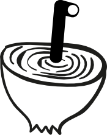

# Periscope
Tor Censorship Analyzer

Periscope is an attempt at implementing a Tor Censorship Analyzer as described [here](www.cs.kau.se/philwint/pdf/foci2013.pdf) and [here](https://trac.torproject.org/projects/tor/wiki/doc/OONI/censorshipwiki/TorCensorshipAnalyzer)
